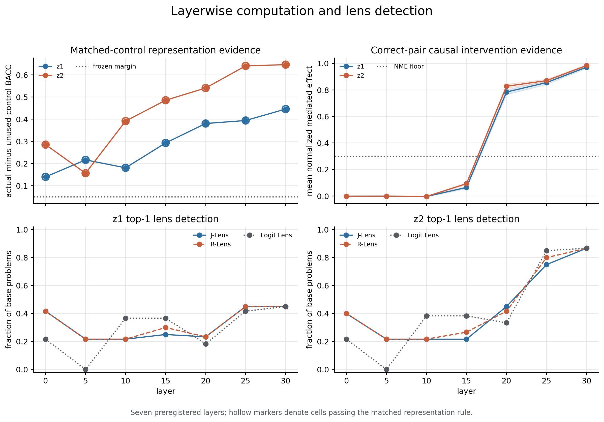

# When Should We Believe a Lens?

This repository contains a small, controlled mechanistic-interpretability
experiment on Qwen3.5-4B. It asks a practical question:

> When a lens says that a hidden state contains a concept, is that concept
> actually represented by the model, and is the model using it to produce its
> answer?

The project compares three readout methods—J-Lens, R-Lens, and Logit Lens—on a
synthetic two-step lookup task. Representation is checked with held-out probes
and matched unused-chain controls. Causal use is checked separately with
activation patching.

The central result is simple: information about the intermediate variables can
be decoded several layers before changing that information has a strong effect
on the model's answer.

- [Inspect the completed run](results/demo-da138d65fd407dfa/DEMO_REPORT.md)
- [Open the Colab notebook](notebooks/colab_demo.ipynb)

## Main result



The upper-left panel shows whether the real intermediate variables are more
decodable than matched variables from an unused control chain. The upper-right
panel shows when patching the intermediate states begins to redirect the
answer. The lower panels show how often each lens ranks the true intermediate
value first.

In the completed run:

- both intermediate variables, `z1` and `z2`, were independently represented
  at every sampled layer;
- their causal effects remained small through the early and middle layers, then
  rose sharply at layer 20;
- the final answer became independently represented at layer 20 and causally
  effective at layers 25 and 30; and
- all eight causally positive variable-layer measurements were also
  represented, while several represented measurements were not yet causal.

J-Lens had the highest point estimate for both aggregate rankings, although its
uncertainty intervals overlapped those of R-Lens.

| Method | Representational AUPRC | Causal AUPRC | Top-1 representational precision | Top-1 causal precision |
| --- | ---: | ---: | ---: | ---: |
| J-Lens | 0.481 | 0.394 | 0.482 | 0.301 |
| R-Lens | 0.452 | 0.352 | 0.474 | 0.301 |
| Logit Lens | 0.431 | 0.338 | 0.442 | 0.296 |

These numbers describe this demonstration only. They do not establish that one
lens is universally better.

## The task and evaluation data

The evaluation data are generated by this repository; they are not a
real-world or downloaded benchmark dataset. Each primary problem implements a
modulus-3 lookup chain:

```text
x -> z1 -> z2 -> answer
```

Each prompt contains two active lookup steps, a randomized single-token output
codebook, two worked examples, and a visually similar unused lookup chain. The
unused chain never determines the answer and provides a matched control for the
representation test.

The canonical completed run is `demo-da138d65fd407dfa`. It contains:

- 200 primary two-step groups: 100 train, 40 validation, and 60 test;
- 24 additional null/control groups used only for diagnostics;
- a base problem and matched counterfactual donors for each primary group;
- residual-stream measurements at the final prompt position from layers
  0, 5, 10, 15, 20, 25, and 30; and
- 70,560 candidate-level test events across the three lens methods.

Headline lens metrics use only the 60 held-out primary test groups. The 24 null
groups do not contribute to the headline comparison.

### Where the data live

The compact completed run is included under
[`results/demo-da138d65fd407dfa`](results/demo-da138d65fd407dfa). The most
important files are:

| Path | Contents | Used for |
| --- | --- | --- |
| `data/task_manifest.json.gz` | Generated problems, roles, latent values, and split assignments | Reconstructing the task set |
| `data/task_table.parquet` | Tabular form of the generated task data | Inspection and downstream processing |
| `data/demo_events.parquet` | Candidate scores and labels for all three lenses | Lens recovery, precision-recall, and Figure 1c-d |
| `data/patching_events_correct_pairs.parquet` | Activation-patching events where both base and donor problems were solved | Causal-effect estimates |
| `metrics/representation_probes.csv` | Probe results before the matched-control decision | Representation analysis |
| `metrics/representation_decisions.csv` | Final representation decision for every variable and layer | Figure 1a and the 17 represented measurements |
| `metrics/causal_decisions.csv` | NME, intervals, interchange accuracy, and causal labels | Figure 1b and the eight causal measurements |
| `metrics/demo_metrics.csv` | Aggregate metrics for J-Lens, R-Lens, and Logit Lens | Table 1 and Figures 2-3 |
| `diagnostics/` | Competence, matched-control, and intervention checks | Validity audit |

The included result set deliberately excludes model weights, lens weights,
activation caches, and checkpoints. Those artifacts are downloaded or
generated during a run and are too large for Git.

`NeelNanda/pile-10k` appears in the configuration only as the fitting provenance
of the released J-Lens and R-Lens weights. It is not the evaluation dataset for
the results reported here.

## Repository layout

```text
configs/       Frozen experiment profiles and model/lens configuration
experiments/   Stage entry points and pipeline orchestration
notebooks/     Self-contained Google Colab workflow
results/       Compact canonical completed run
scripts/       Asset download, verification, export, and rebuild utilities
src/           Python package implementing tasks, probes, patching, and metrics
tests/         CPU unit and integration tests
```

Runtime directories such as `runs/`, `checkpoints/`, `hf_cache/`, `tmp/`, and
`output/` are ignored by Git.

## Inspect the included result

Install the package and run the artifact checker:

```bash
python -m venv .venv
source .venv/bin/activate
python -m pip install --upgrade pip
python -m pip install -e ".[dev]"
python scripts/verify_run.py --result-root results/demo-da138d65fd407dfa
```

On Windows PowerShell, activate the environment with:

```powershell
.venv\Scripts\Activate.ps1
```

The verification script checks that the required task, event, metric,
diagnostic, table, and figure artifacts are present and that the event table
contains the columns used by the analysis.

## Reproduce the experiment

### Recommended: Google Colab with an A100

Open [`notebooks/colab_demo.ipynb`](notebooks/colab_demo.ipynb), select an A100
runtime, and choose **Runtime -> Run all**. The notebook installs the project,
mounts Google Drive for resumable storage, runs the four demonstration stages,
displays the report and figures, verifies the output, and exports a checksummed
result bundle.

The default persistent layout is:

```text
MyDrive/jlens_causal_precision_demo/
  runs/<run-id>/
  results/<run-id>/
  checkpoints/<config-hash>/
  exports/jlens_demo_results_<run-id>.zip
```

### Local CUDA run

The full demonstration requires a CUDA GPU with enough memory for
`Qwen/Qwen3.5-4B` in BF16. An A100 is the tested environment.

```bash
python -m venv .venv
source .venv/bin/activate
python -m pip install --upgrade pip
python -m pip install -r requirements.txt
python -m pip install -e .
python experiments/run_demo.py --profile demo
```

For a smaller runtime check with the same scientific rules:

```bash
python experiments/run_demo.py --profile demo_fast
```

The four pipeline stages are:

1. Select and confirm a task using model behavior only; no lens is loaded.
2. Generate and freeze the primary and control problems.
3. Collect activations, train matched probes, and run activation patching.
4. Score all three lenses and produce the metrics, figures, table, and report.

Runs are deterministic from the frozen configuration and seeds. A disconnected
run can resume from the same persistent directory and run ID.

## Scientific safeguards

Representation and causal use are intentionally evaluated independently of the
lenses.

A variable at a layer is counted as represented only when its held-out probe:

1. exceeds chance balanced accuracy by at least 0.10;
2. exceeds the 95th percentile of 50 label permutations; and
3. beats the corresponding unused-chain probe by at least 0.05 balanced
   accuracy points.

A variable at a layer is counted as causally used only when:

1. at least 20 matched pairs remain after requiring correct base and donor
   answers;
2. mean normalized mediated effect (NME) is at least 0.30; and
3. the lower group-bootstrap bound is at least 0.10.

Self-patches and unused-chain patches check that intervention effects are not
caused merely by replacing a residual-stream activation.

## Tests and linting

The CPU test suite does not download the 4B model:

```bash
python -m pytest -q
python -m ruff check .
```

GPU tests are marked separately:

```bash
python -m pytest -m gpu
```

## Limitations

- This is one model, one synthetic task family, one token position, and seven
  sampled layers.
- The experiment is designed to demonstrate the evaluation method, not settle
  broad comparisons among lens architectures.
- The released J-Lens and R-Lens weight files are not stored in the repository.
  The preserved result events are auditable, but exact lens-weight
  reproduction also depends on the external released artifacts.
- The archived run contains a 0.5 percentage-point controlled-choice scoring
  discrepancy between Stage 0 and Stage 2 for one example. Both measurements
  remain well above the frozen competence threshold, and full-vocabulary
  accuracy is unchanged. The run report records the discrepancy.

## License

The code is released under the Apache License 2.0. See [`LICENSE`](LICENSE).
