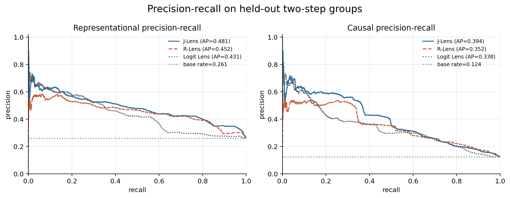
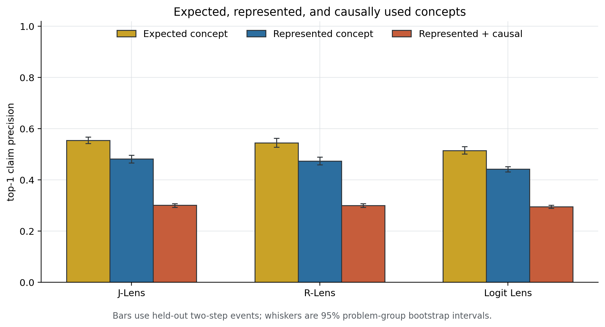

# J-Lens causal precision: small demonstration

**Run:** `demo-da138d65fd407dfa`

**Validation status:** **SUCCESS**

**Model task accuracy:** **93.0%** on final two-step base problems, measured by argmax over the prompt-listed single-token codewords

The unrestricted full-vocabulary next-token result is retained as a diagnostic artifact and is not substituted for this frozen controlled-choice competence definition.

## Technical summary

The demonstration passes its frozen validity conditions. J-Lens has the highest representational AUPRC (0.481). J-Lens has the highest causal AUPRC (0.394). The primary comparison uses only held-out two-step groups; the small null/control family is diagnostic and receives no weight in the headline metrics.

Representation is validated only when an actual latent probe beats both chance/permutation controls and its matched unused-chain probe. Causal use is validated only on pairs where both base and donor problems are solved, using a donor-directed NME floor and positive group-bootstrap lower bound. No raw-IIA cutoff is imposed.

## The controlled computation and validation gates

- Competence gate: pass (93.0% controlled-choice accuracy; hard minimum 75%).
- Matched representation control: valid — answer: 3 control-distinguishable (L20, L25, L30), 4 ambiguous (L0, L5, L10, L15) [ok]; z1: 7 control-distinguishable (L0, L5, L10, L15, L20, L25, L30), 0 ambiguous [ok]; z2: 7 control-distinguishable (L0, L5, L10, L15, L20, L25, L30), 0 ambiguous [ok]. A cell where the probe fires but the matched control is within the margin is *ambiguous*: it is reported and counted as not represented. The control is invalid only if a variable has no control-distinguishable cell among the cells where its probe fires.
- Independently represented cells: 17 (answer@L20, answer@L25, answer@L30, z1@L0, z1@L5, z1@L10, z1@L15, z1@L20, z1@L25, z1@L30, z2@L0, z2@L5, z2@L10, z2@L15, z2@L20, z2@L25, z2@L30).
- Causal-positive cells: 8 (answer@L25, answer@L30, z1@L20, z1@L25, z1@L30, z2@L20, z2@L25, z2@L30).
- Represented-and-causal cells: 8 (answer@L25, answer@L30, z1@L20, z1@L25, z1@L30, z2@L20, z2@L25, z2@L30).
- Activation-intervention controls: valid — identity (`cf_self`) and decoy (`cf_decoy`) patches judged on answer preservation, not on the donor-vs-base logit contrast, which is identically zero for both roles because their donor answer equals the base answer. See `diagnostics/causal_controls.json`.
- Nondegenerate causal target: yes.

The layerwise figure aligns independent representation evidence, correct-pair intervention evidence, and each lens's top-1 recovery. It should be read as correspondence across the seven preregistered layers, not as a densely localized onset estimate.

## Precision and recall

| Method | Repr. AUPRC | Causal AUPRC | Repr. precision | Causal precision |
| --- | --- | --- | --- | --- |
| J-Lens | 0.481 [0.469, 0.497] | 0.394 [0.362, 0.427] | 0.482 [0.467, 0.496] | 0.301 [0.294, 0.308] |
| R-Lens | 0.452 [0.435, 0.472] | 0.352 [0.326, 0.382] | 0.474 [0.459, 0.489] | 0.301 [0.293, 0.308] |
| Logit Lens | 0.431 [0.412, 0.450] | 0.338 [0.309, 0.367] | 0.442 [0.431, 0.452] | 0.296 [0.289, 0.302] |

AUPRC uses every finite score on held-out primary events. The precision columns use the interpretable top-1-within-candidate-universe claim rule. Recall is available in `metrics/demo_metrics.csv`; 90% and 95% operating points are intentionally omitted because this small run was not designed to stabilize them.

## Expected is not the same as represented or causally used

The three bars separate recovery of the symbolically expected variable from recovery of an independently represented variable and from recovery of a variable that is both represented and causally used. Any gap between these bars is the central phenomenon; it must not be described as causal evidence unless the Stage-2 intervention criterion also passes.

## Are high-confidence readouts trustworthy?

J-Lens: repr 0.633, causal 0.589 at 5% coverage; J-Lens: repr 0.561, causal 0.465 at 10% coverage; R-Lens: repr 0.557, causal 0.514 at 5% coverage; R-Lens: repr 0.528, causal 0.428 at 10% coverage; Logit Lens: repr 0.599, causal 0.456 at 5% coverage; Logit Lens: repr 0.576, causal 0.385 at 10% coverage

These are descriptive score-ranked precision values, not calibrated probabilities. A method is trustworthy at high confidence only if precision rises materially as coverage falls and the group-bootstrap uncertainty remains acceptable.

## Direct answers

1. **Does Qwen solve the computation?** Yes; final controlled-choice accuracy is 93.0%.
2. **When are z1 and z2 represented?** answer@L20, answer@L25, answer@L30, z1@L0, z1@L5, z1@L10, z1@L15, z1@L20, z1@L25, z1@L30, z2@L0, z2@L5, z2@L10, z2@L15, z2@L20, z2@L25, z2@L30.
3. **When are they causally used?** answer@L25, answer@L30, z1@L20, z1@L25, z1@L30, z2@L20, z2@L25, z2@L30.
4. **Does J-Lens track these states?** See J-Lens representational and causal precision in the primary table and its layerwise detection curve.
5. **Does R-Lens track them better?** The AUPRC and precision intervals above are the permitted comparison; overlapping intervals should not be called a win.
6. **How does Logit Lens compare?** It is evaluated on the identical events and labels in all three figures and the primary table.
7. **What is representational precision?** P(R_X=1 | top-1 lens claim), reported above with a group-bootstrap interval.
8. **What is causal precision?** P(R_X=1,U_X=1 | top-1 lens claim), reported above with a group-bootstrap interval.
9. **Is there a gap?** Compare the blue and orange bars in Figure 3; interpret only if all validation gates pass.
10. **Are high-confidence readouts trustworthy?** Use the confidence-versus-validity values above; they are descriptive and coverage-dependent.

## Limitations and next step

This is a single-model, single-task-family demonstration at seven layers. The selected task preset was chosen using a disjoint, lens-free competence pilot. The run does not cover full task diversity, all layers, refits, Stage 5, or same-objective regression baselines. If validation fails, the correct result is the failure reason above—not a forced lens ranking. If it succeeds, the next scientific step is the optional coarse-to-fine layer command followed by the preserved publication-scale benchmark.
